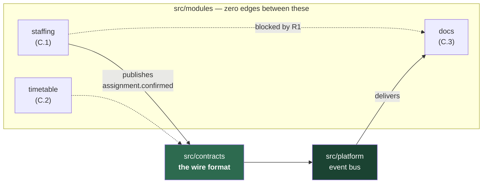

# Platy — CI-enforced module boundaries

A working demonstration for **RFP B.1**:

> "The vendor must demonstrate, in their proposal, how they intend to enforce module boundaries through tooling (automated dependency rules, architecture tests) — **team discipline alone, without a technical control mechanism, is not an acceptable answer** to this requirement."

This repository is the technical control mechanism, not a description of one.

---

## What this proves

| # | Claim | Evidence |
|---|---|---|
| 1 | Modules have real boundaries in the file system | [`src/modules/`](src/modules) — three Phase 1a modules, each with `domain/ application/ infrastructure/ api/` |
| 2 | A tool computes violations automatically | [`.dependency-cruiser.cjs`](.dependency-cruiser.cjs) — R1–R5, `severity: error`, non-zero exit |
| 3 | CI **blocks the merge** | [`architecture.yml`](.github/workflows/architecture.yml) as a **required status check** (screenshot in the submission) |
| 4 | The legal path still works | [`chain-reaction.test.ts`](tests/integration/chain-reaction.test.ts) — confirm assignment → checklist generated, via events |

Claim 4 is the one that matters. A rule that forbids everything is easy; this shows the permitted path working, so the boundary is usable rather than merely restrictive.

---

## Shape

```
src/
  modules/
    staffing/     domain/ application/ infrastructure/ api/     (RFP C.1)
    timetable/    domain/ application/ infrastructure/ api/     (RFP C.2)
    docs/         domain/ application/ infrastructure/ api/     (RFP C.3)
  contracts/      cross-module event + DTO types — the wire format
  platform/       event bus, db schema namespaces, logging
  composition-root.ts    the one file allowed to know every module
```

Only the three Phase 1a modules. Travel, Finance and Analytics are Phase 1b and have no folders here.



The CI job publishes the **generated** graph to the PR summary on every run, so it cannot drift from the code.

---

## The rules

| # | Rule | Name in CI output | Maps to |
|---|---|---|---|
| **R1** | No `modules/X` may import `modules/Y` | `no-cross-module-import` | B.1 extraction-readiness |
| **R2** | `platform/` and `contracts/` may not import `modules/` | `no-platform-or-contracts-to-module` | dependency direction |
| **R3** | Only a module's own `infrastructure/` may touch its DB schema namespace | `no-foreign-schema-access` | B.2 shared model, owned writes |
| **R3b** | Even within a module, only `infrastructure/` touches schema | `no-schema-access-outside-infrastructure` | B.2 |
| **R4** | `domain/` may not import `infrastructure/` | `no-domain-to-infrastructure` | keeps the domain portable |
| **R5** | Chain reactions only via `contracts/` events | *enforced via R1 — see below* | B.4 |

### On R5, stated honestly

`dependency-cruiser` analyses **imports**, not runtime message flows. It cannot literally observe "this chain reaction travelled over an event."

What it can do is make every alternative impossible. Once R1 holds, no module can reach another module's code at all — so `contracts/` plus the event bus is the only remaining route. R5 is enforced **negatively**, as a consequence of R1, and the integration test then proves the permitted route actually works.

We would rather state that precisely than claim a rule inspects something it does not.

### R1 scales without edits

`from.path` captures the module name and `to.path` back-references it with `$1`:

```js
from: { path: "^src/modules/([^/]+)/" },
to:   { path: "^src/modules/([^/]+)/", pathNot: "^src/modules/$1/" },
```

One rule covers every present and future module. Adding Travel or Finance in Phase 1b requires no config change.

---

## Why R3 is not optional

RFP B.2 mandates **one shared database** across all modules. The standing objection to a modular monolith on a shared database is that nothing stops module A writing module B's tables — and once that happens, the data can no longer be split along module lines and Phase 2 extraction is dead, whatever the folder structure says.

R3 is the pre-emptive answer, and it is enforced rather than documented: each module owns a schema namespace (`staffing_*`, `timetable_*`, `docs_*`) that only its own `infrastructure/` layer may import. Shared database, exclusively owned writes.

---

## Phase 2 extraction

`src/contracts/` is the wire format.

Today `assignment.confirmed` travels in-process over the event bus. When Docs is extracted to its own service, **that same payload becomes the network payload, unchanged**. Only the bus implementation changes — to SNS/SQS or webhooks per B.1. No module's domain or application code is touched.

This is why cross-module calls are forced through contracts rather than direct imports: a direct import cannot cross a process boundary, but a serialised event can. The boundary rules are not stylistic — they are what keeps the microservices path open without a rewrite.

Evidence in the test suite: a second subscriber (standing in for Travel, D.1) receives the same event with **no change to Staffing**.

---

## Running it

```bash
npm ci
npm run verify          # typecheck + boundaries + tests + coverage
```

| Command | What it does |
|---|---|
| `npm run boundaries` | R1–R5. Non-zero exit on violation |
| `npm run boundaries:graph` | Mermaid dependency graph |
| `npm test` | Architecture tests + chain-reaction integration test |
| `npm run test:coverage` | Adds B.8 coverage thresholds |

---

## Two findings worth flagging

**1 · A silent false pass, caught during verification.** With no resolvable TypeScript compiler, `dependency-cruiser` cruises **0 modules**, prints *"no dependency violations found"*, and **exits 0** — a green build that scanned nothing.

Mitigated in two places: `typescript` is a hard dependency, and both the CI job and an architecture test assert that the cruiser actually saw the tree (`totalCruised`). A boundary checker that can silently no-op is worse than none, because it manufactures false confidence.

**2 · `tsPreCompilationDeps` is load-bearing.** Without it, a dynamic `await import("../../docs/...")` is invisible and R1 is trivially bypassed. [`boundaries.test.ts`](tests/architecture/boundaries.test.ts) asserts that all three evasion routes — direct import, barrel re-export, dynamic import — are still caught.

---

## Tooling choice

**`dependency-cruiser` 18.3.0** for the dependency rules, **hand-rolled Vitest assertions** for the architecture tests. B.1 names both mechanisms; this ships both.

Also evaluated:

- **`tsarch`** (npm `tsarch`, repo `ts-arch/ts-arch`) — the ArchUnit-style option for TypeScript. Last published 2024-12-23. A stale dependency guarding the build is a worse risk than ~40 lines of assertions over the cruiser's own JSON output.
- **Nx tag-based boundaries** (`@nx/enforce-module-boundaries`) — strong, but adopting Nx to get one lint rule imposes a monorepo toolchain the rest of the project does not need.
- **TypeScript project references** — genuine compile-time enforcement, but it makes the build graph harder to work with and does not express R3 (schema ownership) at all.
- **`eslint-plugin-boundaries`** — good editor-time feedback; ESLint `no-restricted-imports` covers the same ground with no extra dependency. Useful *alongside* CI, not instead of it: the editor warns, CI blocks.

---

## RFP mapping

| Requirement | Where |
|---|---|
| B.1 automated dependency rules | [`.dependency-cruiser.cjs`](.dependency-cruiser.cjs) |
| B.1 architecture tests | [`tests/architecture/`](tests/architecture) |
| B.2 shared model, owned writes | R3 + [`src/platform/db/schema/`](src/platform/db/schema) |
| B.4 chain reaction | [`chain-reaction.test.ts`](tests/integration/chain-reaction.test.ts) |
| B.8 senior review on every PR | [`CODEOWNERS`](.github/CODEOWNERS) + required review |
| B.8 100% coverage on chain-reaction hooks | [`vitest.config.ts`](vitest.config.ts) |
| B.9 CI on every pull request | [`architecture.yml`](.github/workflows/architecture.yml) |
| C.3 §1 sector-specific checklists | [`checklist.ts`](src/modules/docs/domain/checklist.ts) |
